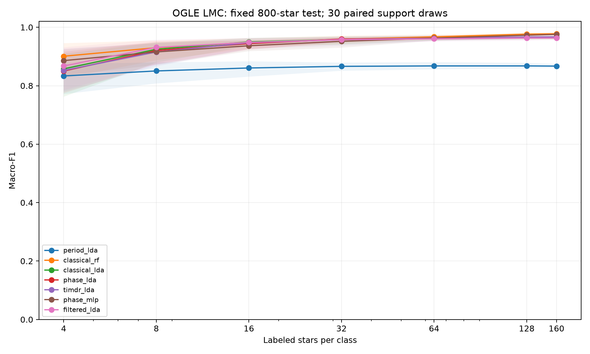

# Wyniki: TIMDR-lightcurve-fewshot — pilotaż OGLE LMC

Pierwotny cel przewagi nad lasem losowym nie został spełniony w tym pilotażu.

Model działa na rzeczywistych danych i został zapisany. Poniższe wyniki dotyczą znanych okresów katalogowych, czterech znanych klas i jednego przeglądu. Nie rozstrzygają o skuteczności na nowych przeglądach ani przy nieznanym okresie.

## Zbiór i test

2000 gwiazd: po 500 RRab, RRc, CEP-F, CEP-1O. Pula ucząca: 300 na klasę; niezależny od niej, stały test: 200 na klasę. 30 identycznych dla metod, zagnieżdżonych losowań przykładów przy każdym budżecie. Łącznie 1470 głównych dopasowań oraz 135 dopasowań kontrolnych. Gwiazda jest jednostką podziału, nie pojedynczy pomiar ani wycinek. Usunięto duplikaty fotometrii i pozycje bliższe niż 2 sekundy łuku. Nie dobierano parametrów na teście.

## Średnie macro-F1

Kolumny oznaczają liczbę etykiet na klasę. Macro-F1 nie jest procentem poprawnych wskazań. Wszystkie metody poza kontrolą samego okresu dostają okres, amplitudę oraz względny błąd pomiaru.

| Metoda | 4 | 8 | 16 | 32 | 64 | 128 | 160 |
|---|---:|---:|---:|---:|---:|---:|---:|
| Tylko okres + LDA | 0.833 | 0.851 | 0.861 | 0.866 | 0.868 | 0.868 | 0.867 |
| Cechy klasyczne + las losowy | 0.901 | 0.930 | 0.947 | 0.958 | 0.967 | 0.977 | 0.978 |
| Cechy klasyczne + LDA | 0.858 | 0.925 | 0.950 | 0.958 | 0.962 | 0.964 | 0.964 |
| Krzywa fazowa + LDA | 0.850 | 0.921 | 0.944 | 0.960 | 0.962 | 0.964 | 0.964 |
| TIMDR + LDA | 0.852 | 0.915 | 0.947 | 0.958 | 0.963 | 0.966 | 0.967 |
| Krzywa fazowa + mała sieć | 0.886 | 0.916 | 0.937 | 0.952 | 0.963 | 0.973 | 0.976 |
| Samo sito + LDA | 0.868 | 0.931 | 0.948 | 0.958 | 0.961 | 0.963 | 0.963 |

## Porównanie zaplanowane przed wynikami

Średnia różnica TIMDR − las losowy dla 4, 8, 16 i 32 etykiet: **-0.0159 macro-F1**, 95% przedział bootstrap z losowań uczących [-0.0217, -0.0097]. Cel praktyczny: co najmniej +0.02 i dolna granica powyżej zera.

TIMDR − krzywa fazowa przy tym samym LDA: **-0.0005**, przedział [-0.0055, +0.0042]. Wariant „samo sito” oddziela efekt filtrowania od efektu dodania cech koherencji i harmonicznych.

Przedziały z 30 losowań opisują zmienność doboru etykiet na jednym teście. Nie są 30 niezależnymi powtórzeniami na populacji gwiazd. Dodatkowy bootstrap gwiazd testowych przy n=4 utrzymuje losowania uczące stałe; też nie mierzy transferu między przeglądami.

- Bootstrap gwiazd przy 4 etykietach, TIMDR − Cechy klasyczne + las losowy: [-0.0589, -0.0386].
- Bootstrap gwiazd przy 4 etykietach, TIMDR − Krzywa fazowa + LDA: [-0.0044, +0.0083].

## Kontrole

Pomieszane etykiety, n=32: macro-F1 **0.226**. Przy czterech zrównoważonych klasach orientacyjny wynik losowy wynosi 0.25; dokładne macro-F1 zależy od rozkładu predykcji.

| Metoda | Prawidłowy okres, n=4 (te same 5 prób) | Okres +1%, n=4 (5 prób) |
|---|---:|---:|
| Tylko okres + LDA | 0.841 | 0.841 |
| Cechy klasyczne + las losowy | 0.893 | 0.848 |
| Cechy klasyczne + LDA | 0.870 | 0.671 |
| Krzywa fazowa + LDA | 0.850 | 0.465 |
| TIMDR + LDA | 0.849 | 0.446 |
| Krzywa fazowa + mała sieć | 0.882 | 0.431 |
| Samo sito + LDA | 0.867 | 0.502 |

## Granice wniosku

- Wybrane klasy okresowe z dobrym pokryciem fazy; nie obejmuje to dowolnych ani nowo odkrytych klas.
- Katalogowy okres i etykieta pochodzą z OGLE; to wariant z korzystnym, znanym zegarem. Test +1% mierzy wrażliwość, nie jakość odzyskiwania okresu.
- Nie wykonano transferu na inny przegląd ani podziału przestrzennego. Wykluczenie sąsiadów do 2 sekund łuku nie zastępuje audytu wszystkich fizycznych duplikatów.
- Mała sieć ma stałą architekturę i ustawienia. Jej wynik nie reprezentuje wszystkich sieci ani najlepiej dostrojonego modelu.
- Liczba dopasowań z ostrzeżeniem zbieżności: 0. Ostrzeżenia są zapisane przy każdej predykcji.
- Klasyczne momenty to zwykłe skośność i kurtoza po skalowaniu odpornym amplitudą; sformułowanie „robust skew/kurtosis” w protokole nie oznacza odpornego estymatora tych momentów. Nie obcinano odstających pomiarów.
- Protokół zapisano lokalnie przed wynikami; nie ma zewnętrznej prerejestracji. Wersja ta nie była poprawiana na podstawie punktacji.
- Nie wolno przenosić wcześniejszego wyniku „8 razy mniej etykiet” z łożysk na ten eksperyment.

## Modele i odtworzenie

Zapisano `models/timdr_lda.joblib` i `models/classical_rf.joblib`. Każdy korzysta z 640 etykiet (160 na klasę), z pierwszego ustalonego losowania. Modelu nie wybrano według wyniku testowego. Instrukcja wejściowego CSV i uruchomienia: [README.md](README.md). Identyfikatory i sumy kontrolne: [manifest](results/manifest.json), [audyt](results/data_audit.json).

Kod implementuje eksperymentalną adaptację sygnałowych wskazówek [GIA-TIMDR](https://github.com/jbackk-lang/GIA-TIMDR). Dane: [OGLE RR Lyrae](https://www.astrouw.edu.pl/ogle/ogle4/OCVS/lmc/rrlyr/) i [OGLE cefeidy](https://www.astrouw.edu.pl/ogle/ogle4/OCVS/lmc/cep/). Publikacje źródłowe wymieniono w README.

## ASTROMER

Wykonano dodatkowe porównanie z zamrożonym ASTROMER 1 (MACHO, biblioteka 0.1.8), średnią embeddingów i LDA. Te same gwiazdy, etykiety, metadane i losowania. Brak dostrajania na OGLE. Możliwe pokrywanie się fizycznych gwiazd z korpusem MACHO nie zostało wykluczone; to porównanie eksploracyjne, bez dowodu przewagi nad modelami foundation. Wyniki: {"4": 0.682918747774119, "8": 0.7904984342407556, "16": 0.856692483585036, "32": 0.878587787512363, "64": 0.8876383335225763, "128": 0.8932141991831586, "160": 0.8941808731562195}
